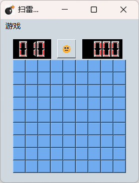

# 扫雷游戏项目总结

## 项目基本信息
- **开发环境**：Qt Creator
- **功能**：实现基本的扫雷游戏功能，包括开始游戏、难度选择、计时等

## 功能概览
- **双击功能**：允许玩家双击以快速展开数字周围的区域。
- **胜利显示**：当玩家翻开所有无雷区域时，显示胜利提示。
- **界面显示**：提供了图形用户界面，增强了用户体验。
- **难度选择**：玩家可根据技能选择不同难度级别。
- **计时器**：游戏过程中提供了计时功能，增加游戏挑战性。
- **地图初始化**：确保每次开始新游戏时地图正确初始化。

## 游戏逻辑
- 引入了雷区的随机生成，确保每次游戏的地图都是新的。
- 双击、左键和右键操作均经过逻辑处理，以符合扫雷游戏规则。

## 技术实现
- 使用Qt框架进行GUI设计
- 通过`QTimer`实现游戏计时功能
- 采用`QPushButton`作为游戏界面的按钮
- 使用数组存储游戏地图状态

## 项目链接
[项目链接](https://github.com/2535521265/qt-mine)

