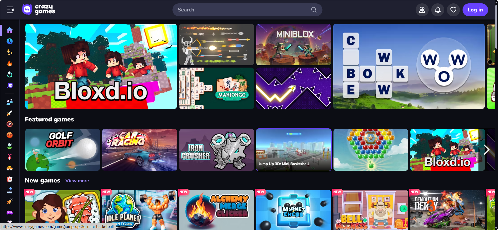

#### 各种各样有意思的网址，游戏，工具，学习，视频等，有需要可以看一下

#### 目录
- [1. 小游戏合集](#1-小游戏合集)
- [2. 童年小霸王游戏](#2-童年小霸王游戏)
- [3. 背单词](#3-背单词)
- [4. 免费高清的动漫(AGE动漫)](#4-免费高清的动漫age动漫)
- [5. 免费高清的电影（4K影院）](#5-免费高清的电影4k影院)
- [6. 电影追剧(FREEOK)](#6-电影追剧freeok)
- [7. 笔趣阁小说](#7-笔趣阁小说)
- [8. 看漫画](#8-看漫画)
- [9. 俄区游戏平台](#9-俄区游戏平台)
- [10. flysheep资源避难所](#10-flysheep资源避难所)
- [11. 风灵月影修改器](#11-风灵月影修改器)
- [12. 2048小游戏](#12-2048小游戏)
- [13. LKs 网站推荐合集](#13-lks-网站推荐合集)
- [14. 壁纸wallhaven](#14-壁纸wallhaven)
- [15. Nazo Game解谜游戏](#15-nazo-game解谜游戏)
- [16. 文字密室逃脱](#16-文字密室逃脱)
- [17. 模拟驾驶](#17-模拟驾驶)
- [18. 在线画圆](#18-在线画圆)
- [19. 在线贪吃蛇](#19-在线贪吃蛇)
- [20. 动漫女孩生成器](#20-动漫女孩生成器)
- [21. 手指节奏游戏](#21-手指节奏游戏)
- [22. 随机网站访问器](#22-随机网站访问器)
- [23. 在线小游戏](#23-在线小游戏)
- [24. 表情合成器](#24-表情合成器)
- [25. 在线拼图](#25-在线拼图)
- [26. 植物大战僵尸各种资源下载](#26-植物大战僵尸各种资源下载)
- [27. 时光邮局](#27-时光邮局)
- [28. 在线繁体字转换](#28-在线繁体字转换)
- [29. 照片去杂物](#29-照片去杂物)
- [30. 文件转换器](#30-文件转换器)

### 1. <a href="https://www.crazygames.com/" target="_blank">小游戏合集</a>
可以在线玩的小游戏平台，类似于4399，很多游戏很有意思，以前喜欢玩里面的2048版的贪吃蛇，因为是国外的，有时候会进不去。

### 2. <a href="https://www.yikm.net/" target="_blank">童年小霸王游戏</a>
全是回忆，可以直接玩，好玩爱玩。

### 3. <a href="https://qwerty.cooleryue.cn/" target="_blank">背单词</a>
没事干就来背单词，还能练习打字，挺不错的。

### 4. <a href="https://www.agedm.org/" target="_blank">免费高清的动漫(AGE动漫)</a>
现在免费的动漫网站越来越少了，不是在倒闭就是在倒闭的途中，这个还行。

后面就不贴图了，好累。
### 5. <a href="https://www.4kvm.net/movies" target="_blank">免费高清的电影（4K影院）</a>
之前在这个网址看的星际穿越，挺高清的。

### 6. <a href="https://freeokk.pro/" target="_blank">电影追剧(FREEOK)</a>
云边有个小卖部电影在这里看的，挺不错的。电影，电视剧，动漫都有。

### 7. <a href="https://www.bqgui.cc/" target="_blank">笔趣阁小说</a>
这个不用多说了吧，网页版，还没广告，摸鱼神器。

### 8. <a href="https://www.dm5.com/" target="_blank">看漫画</a>
看漫画的。现在看的少了，不过以前挺喜欢的。

### 9. <a href="https://byruthub.org/" target="_blank">俄区游戏平台</a>
俄罗斯的盗版游戏平台，基本上什么都有，但是需要科学上网。不提倡盗版，不过可以提前试玩，喜欢的话再购买正版。

### 10. <a href="https://www.flysheep6.com/" target="_blank">flysheep资源避难所</a>
也是盗版游戏，不过这个网站是中文的，比较容易找到，而且资源没有那么全，但是基本上该有的都有。

### 11. <a href="https://flingtrainer.com/" target="_blank">风灵月影修改器</a>
有了游戏怎么少的了修改器呢，本人比较喜欢玩一些独立游戏，都是单机的，有时候懒得打就改一下局外数值，现在基本不用了，有时候用一下CE修改器，改一改需要肝的；不建议大家用，既然是玩游戏，当然要好好体验了。

### 12. <a href="https://2048game.com/" target="_blank">2048小游戏</a>
在线的2048，这个游戏算是家喻户晓了，小时候玩过，现在没事的时候点进去也能玩一会，摸鱼的时候耍一下。我的记录是8192。切忌不能心急。

### 13. <a href="https://lkssite.vip/" target="_blank">LKs 网站推荐合集</a>
一个导航网址，里面东西挺多的，没事的时候可以逛一下。

### 14. <a href="https://wallhaven.cc/toplist" target="_blank">壁纸wallhaven</a>
国外的壁纸网站，也是个人最喜欢的壁纸网站，很多壁纸都是在里面找的，4k画质，可以任意裁剪大小成适应成你的屏幕，还有手机壁纸，登录还能解锁隐藏图片噢，不过有时候需要梯子，只要你会用,这里的壁纸基本能满足你的要求。 \
还有一些壁纸网站都放这吧。 \
1.<a href="https://pic.netbian.com" target="_blank">彼岸网图</a> 
2.<a href="https://bz.zzzmh.cn" target="_blank">极简壁纸</a> 
3.<a href="https://www.wallpaperhub.app/wallpapers" target="_blank">WallpaperHub</a> 
4.<a href="https://wallpaperscraft.com" target="_blank">Wallpaperscraft</a> 

### 15. <a href="https://nazo.one-story.cn/" target="_blank">Nazo Game解谜游戏</a>
非常有意思的解密网站，通过答案进入下一关，谜题涉及电脑知识,语言学,梗等等。一共51关，听说有人第一关过不去？喜欢解谜的不能错过。

### 16. <a href="https://nodes-escape.hzfe.org/" target="_blank">文字密室逃脱</a>
这个游戏很有意思，需要一点脑洞和想法，开始玩的时候还没那么火，直到我在群里说，上架steam，做大做强，好好好，没想到群主真上架steam了，看了下评价卖的还不错。现在再网址能体验7关，后面的需要去steam购买，还好我已经玩过了，不然就亏大了嘿嘿。有一说一，这类游戏确实挺有意思。

### 17. <a href="https://slowroads.io/" target="_blank">模拟驾驶</a>
在线体验驾驶，在公路上体验各种车，还能改变天气，地形，打法时间的小游戏，还可以第一人称，不过是英语，都是些简单的英语单词也不影响。

### 18. <a href="http://360360.top/" target="_blank">在线画圆</a>
一个画圈圈的网站，我最高是94。

### 19. <a href="http://slither.io/" target="_blank">在线贪吃蛇</a>
一个在线的贪吃蛇网址，不用登录，点击即玩。

### 20. <a href="https://www.thiswaifudoesnotexist.net/" target="_blank">动漫女孩生成器</a>
ai生成的动漫女孩，每次都是独一无二。

### 21. <a href="https://aidn.jp/mikutap/" target="_blank">手指节奏游戏</a>
当你不知道干什么的时候点进去，只要疯狂点就好了，键盘也可以，魔性的音乐和炫酷的动画让你停不下来，我也不知道我在点什么。

### 22. <a href="https://theuselessweb.com/" target="_blank">随机网站访问器</a>
这是一个随机网站访问器,当你按下PLEASE的时候，会随机打开一个网站。

### 23. <a href="https://poki.com/zh#utm_source=china" target="_blank">在线小游戏</a>
也是一个在线小游戏合集，玩个4399还得下flash才能玩，这个更方便，游戏多，很多很有意思，还没有广告。

### 24. <a href="https://tikolu.net/emojimix/%F0%9F%A5%B8+%F0%9F%A6%87" target="_blank">表情合成器</a>
可以把各种各样的黄豆人表情和其他表情融合，生成独一无二的表情，可以复制，下载，可以看看排行榜上的表情，挺有意思。

### 25. <a href="https://gallerix.asia/pazly/" target="_blank">在线拼图</a>
在线拼图，超17万张图片，可以选择喜欢的图片拼图，还能定义块数。

### 26. <a href="http://jspvz.com/download.htm" target="_blank">植物大战僵尸各种资源下载</a>
这是一个比较齐全的植物大战僵尸的资源网站，包含各个版本，手机，电脑，网页。其中的β版和95版可以说一代中最经典的，还有但小姑之梦，现在的杂交版也不错。

### 27. <a href="https://www.hi2future.com/" target="_blank">时光邮局</a>
这是一个可以给未来的自己写邮件的地方，已经成立了十多年了，可以给自己或者认识的人写一封未来邮件。也可以看别人公开的邮件，看了一些感触挺深的，今天整理才想起来这个网站，几年前我也给三十岁的自己写过，具体内容是什么我也忘记了，还早着，不知道以后看到是什么感觉。

### 28. <a href="http://www.aies.cn/" target="_blank">在线繁体字转换</a>
将简体中文转换成繁体字，以前在台服玩游戏取名字用的。

### 29. <a href="https://cleanupphotos.com/" target="_blank">照片去杂物</a>
在线去除图片上的杂物，之前没用过，刚试了一下，确实毫无违和感，不错。

### 30. <a href="https://convertio.co/zh/" target="_blank">文件转换器</a>
可以将文件转换成任意格式，格式不对？转！有时候pdf想转成word不方便，用它就对了。

目前就这些吧，有时间整理了在更新。